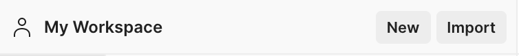
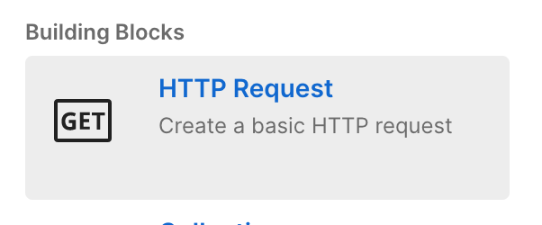
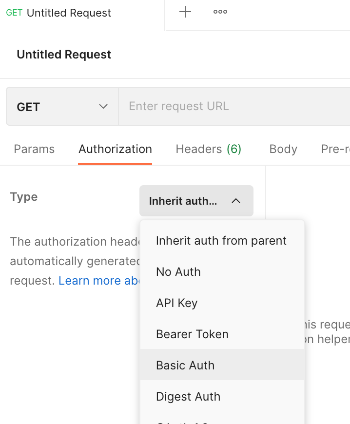
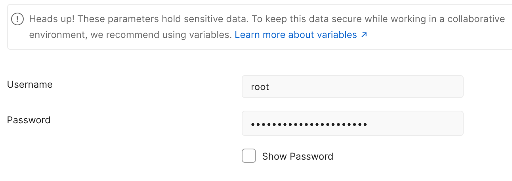
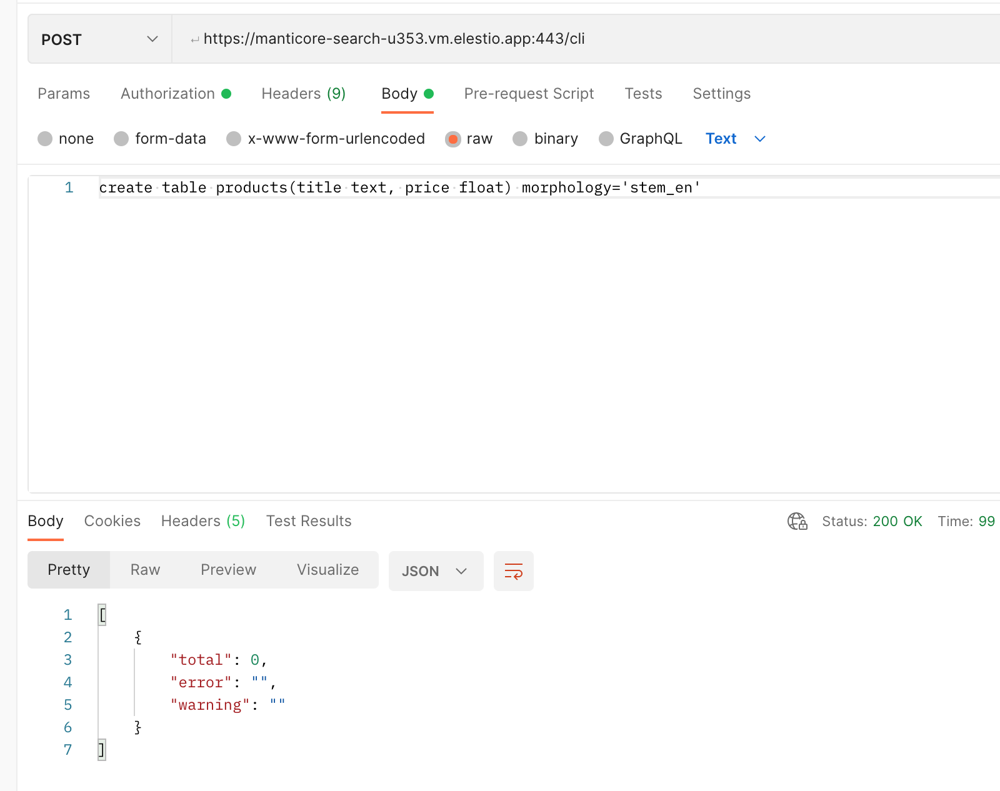

# Manticore Search CI/CD pipeline

Deploy Manticore Search server with CI/CD on Elestio

 
 

# Once deployed ...

# Curl examples

## create index

        curl -sX POST https://root:[ADMIN_PASSWORD]@[CI_CD_DOMAIN]/cli -d "create table products(title text, price float) morphology='stem_en'"

## Add documents

    curl -sX POST https://root:[ADMIN_PASSWORD]@[CI_CD_DOMAIN]/insert  -d '
    {
        "index":"products",
        "doc":
        {
            "title" : "Crossbody Bag with Tassel",
            "price" : 19.85
        }
    }'

    curl -sX POST https://root:[ADMIN_PASSWORD]@[CI_CD_DOMAIN]/insert  -d '
    {
        "index":"products",
        "doc":
        {
            "title" : "microfiber sheet set",
            "price" : 19.99
        }
    }'

    curl -sX POST https://root:[ADMIN_PASSWORD]@[CI_CD_DOMAIN]/insert  -d '
    {
        "index":"products",
        "doc":
        {
            "title" : "Pet Hair Remover Glove",
            "price" : 7.99
        }
    }'

## search

    curl -sX POST https://root:[ADMIN_PASSWORD]@[CI_CD_DOMAIN]/search  -d '
    {
        "index": "products",
        "query": { "match": { "title": "remove hair" } },
        "highlight":
        {
            "fields": ["title"]
        }
    }'

## update

    curl -sX POST https://root:[ADMIN_PASSWORD]@[CI_CD_DOMAIN]/update  -d '
    {
        "index": "products",
        "id": 1513686608316989452,
        "doc":
        {
            "price": 18.5
        }
    }'

## 1.

Go to your favorite API platform.
In our case, we will use POSTMAN.

You can download it here: <a targer="_blank" href="https://www.postman.com/">Postman client</a>

## 2.

Once installed and opened, click on New, then on HTTP Request

## 3.

Go to Authorization, choose Basic Auth and enter these credentials:

    username: root
    password: [ADMIN_PASSWORD]

## 4.

### Create an index

Let's now create an index called "products" with 2 fields:

    title - full-text field which will contain our product's title

    price - of type "float"

Choose POST method, and in the url input tape your url and at the end /cli like that:

    https://[CI_CD_DOMAIN]/cli

Go to body and row section, and type this:

        create table products(title text, price float) morphology='stem_en'

You will see this response:

### Let's now add few documents to the index

Instead /cli, put /insert in your url and type this:

        {
            "index":"products",
            "doc":
                {
                    "title" : "Crossbody Bag with Tassel",
                    "price" : 19.85
                }
            }

            POST /insert
            {
                "index":"products",
                "doc":
                {
                    "title" : "microfiber sheet set",
                    "price" : 19.99
                }
            }

            POST /insert
            {
                "index":"products",
                "doc":
                {
                    "title" : "Pet Hair Remover Glove",
                    "price" : 7.99
                }
        }

### Search

At the end of url put /search and type this:

        {
        "took": 0,
        "timed_out": false,
        "hits": {
            "total": 1,
            "hits": [
                        {
                            "_id": "1513686608316989452",
                            "_score": 1680,
                            "_source": {
                            "price": 7.99,
                            "title": "Pet Hair Remover Glove"
                            },
                            "highlight": {
                            "title": [
                                "Pet <strong>Hair Remover</strong> Glove"
                                    ]
                            }
                        }
                    ]
                }
        }

### Update

At the end of URL type this: /update and this code in the body:

    {
        "index": "products",
        "id": 1513686608316989452,
        "doc":
        {
            "price": 18.5
        }
    }

### Delete

At the end of URL type this: /delete and this code in the body:

    {
        "index": "products",
        "query":
        {
            "range":
            {
                "price":
                {
                    "lte": 10
                }
            }
        }
    }

For more informations, you can go to the manual of Manticore Search here <a target="_blank" href="https://manual.manticoresearch.com/Quick_start_guide#Search">Doc Manticore Search</a>
